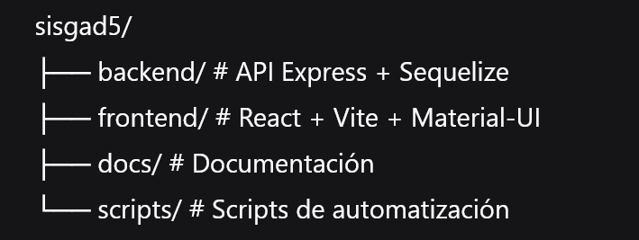

# Setup Inicial - SISGAD5

## Estructura del Proyecto

## Tecnologías Utilizadas

### Backend
- Express.js
- Sequelize (ORM)
- PostgreSQL
- JWT (Autenticación)
- Bcrypt (Encriptación)

### Frontend
- React 18
- Vite
- Material-UI
- Axios

## Configuración Inicial

1. **Clonar/crear proyecto**
2. **Ejecutar:** `npm run install:all`
3. **Configurar .env** en backend/
4. **Iniciar servidores:** `npm run dev`

## Próximos Pasos

1. Configurar base de datos PostgreSQL
2. Generar modelos automáticamente
3. Desarrollar autenticación
4. Crear componentes base